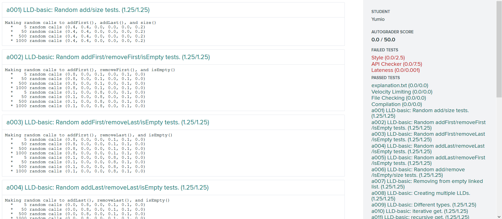
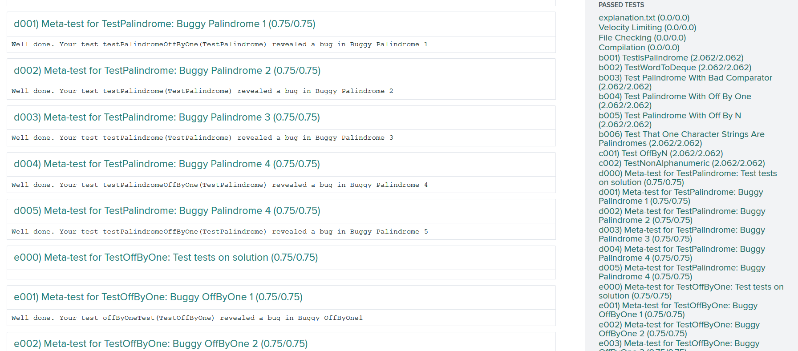
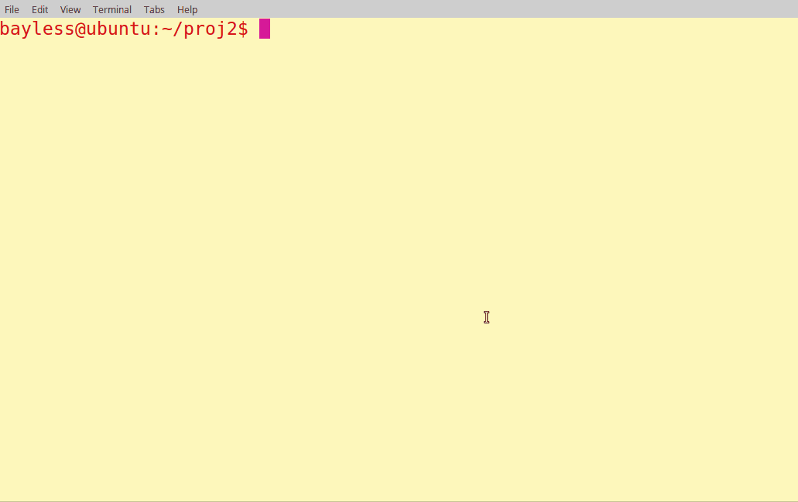
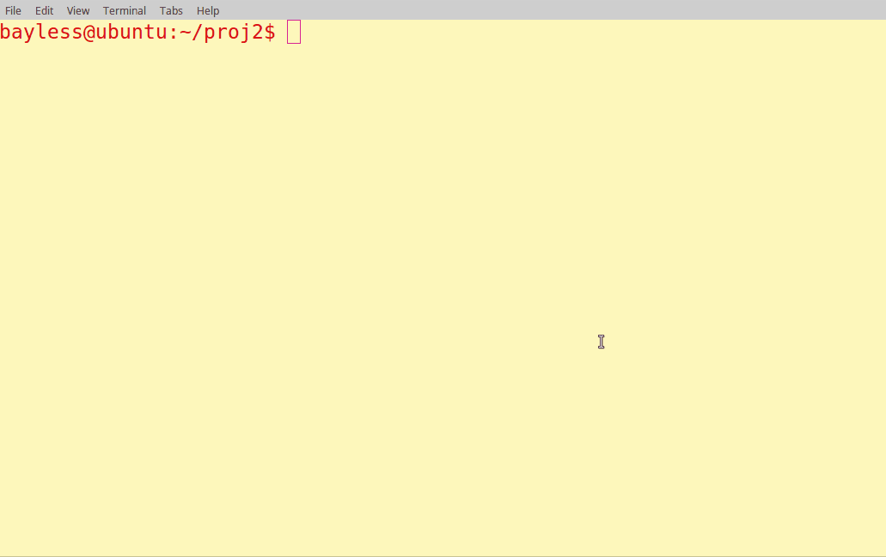
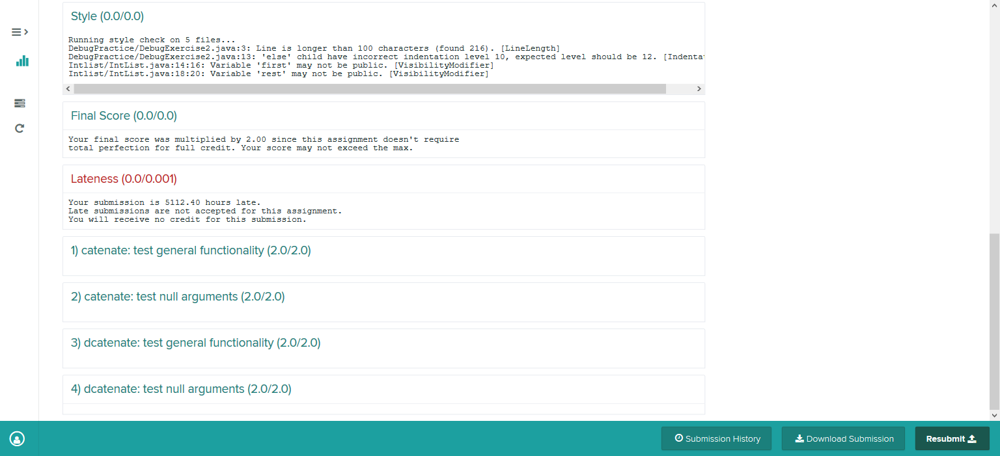
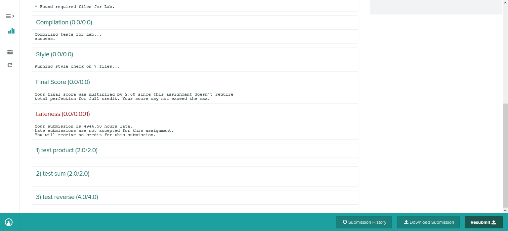

# [CS 61B](https://sp18.datastructur.es/)
## Data Structures, Spring 2018 by UC Berkeley

### Introduction
In CS61B, we’re concerned also with engineering. An engineer, it is said, is someone who can do for a dime what any fool can do for a dollar. Much of 61B will be concerned with the tradeoffs in time and memory for a variety of methods for structuring data. We’ll also be concerned with the engineering knowledge and skills needed to build and maintain moderately large programs.

 ### Acknowledgement
 Great thanks to *UC Berkeley*, an awesome and outstanding university, that keeps making a host of invaluable educational materials open to the public, even **autograders** for this year, which I appreciate so much. I really mean it, sincerely.

### My self-learning Coursework
  - finished:
    - [x] Week1~7
    - [x] hw1
    - [x] proj0~2
    - [x] lab1~5
  - TODO:
    - [ ] Week8~14
    - [ ] hw2~7
    - [ ] lab9~15
    - [ ] proj3

### Result
  For project 2, I chose to work on spring 2017 version, in which students are required to build a small version of what is called a relational database management system (DBMS), as well as a DSL (Domain Specific Language) with which a user can interact with the database.

  All other work was done by following the spring 2018 version of CS61B. **Source codes are lying in another repository, privately.**

  - Project
    1. Projcet0 - NBody
      - Running results:
        - planets:
        

        - sun interference:
        

        - glaxay:
        

      - tests from GradeScope:
        

    2. Project1 - Data Structures
      - tests from GradeScope:
        - project1A:
          
        - project1B:
          
        - project1gold:
          

    3. [Projcet2 - database](http://datastructur.es/sp17/materials/proj/proj2/proj2.html)
      - [data files](data/project2/)
      - running results:
        - query examples from the project2 spec webpage
        

        - more complicated queries with multiple conditions and some arithmetic operations:
        

  - Homework
    1. hw1
      - tests from GradeScope:
        

  - lab
    1. lab2
      - tests from GradeScope:
        

    2. lab3
      - tests from GradeScope:
        
