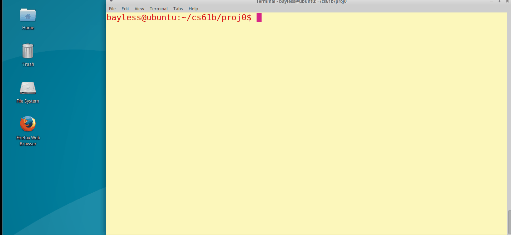
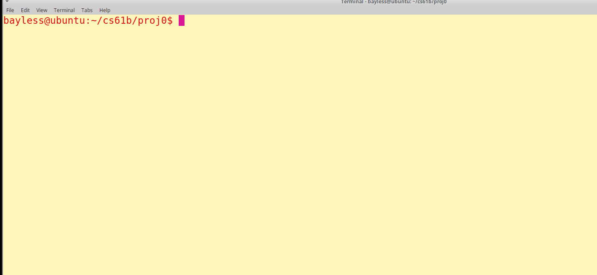
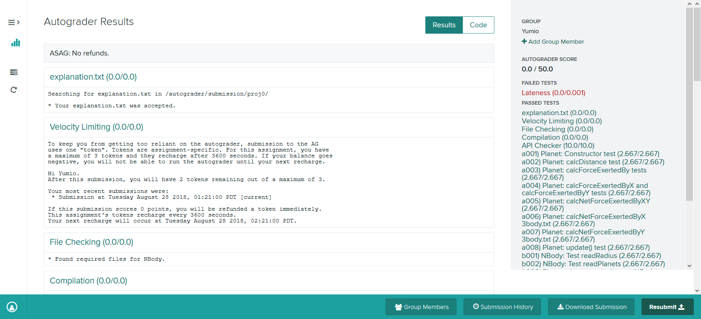
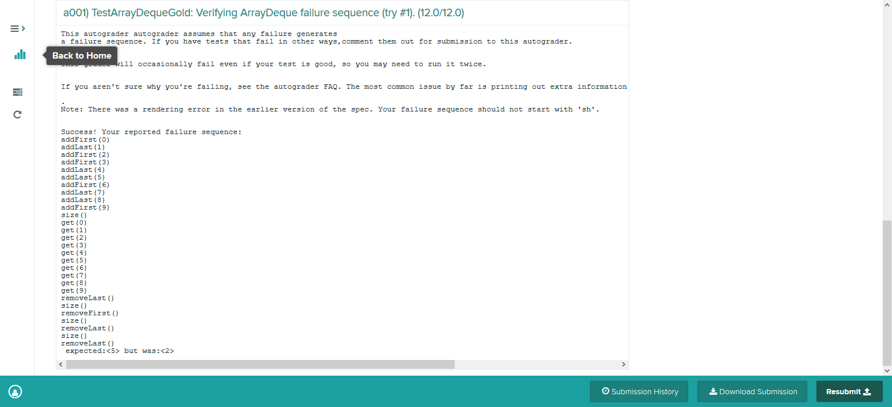
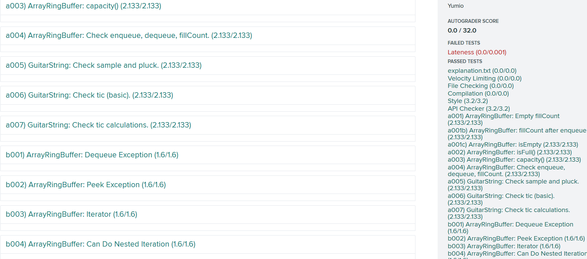
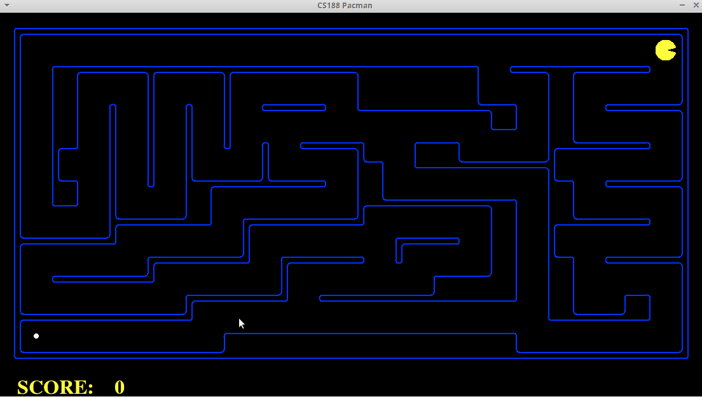
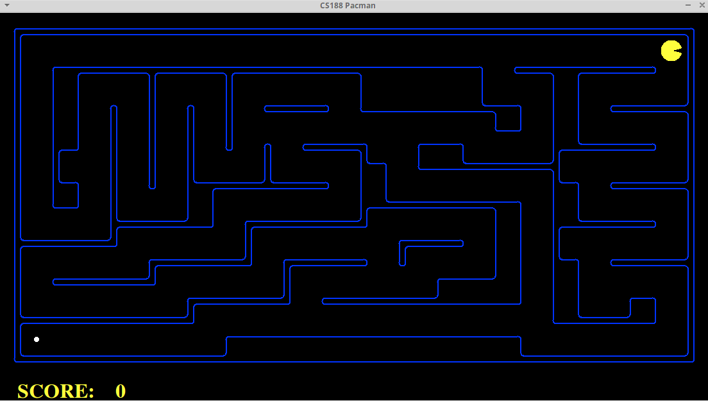
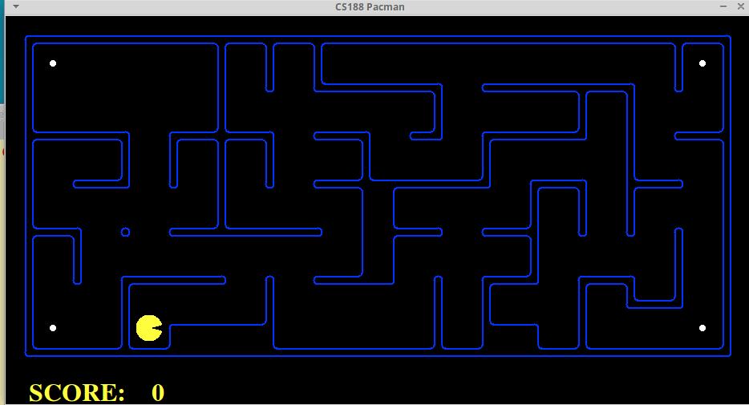
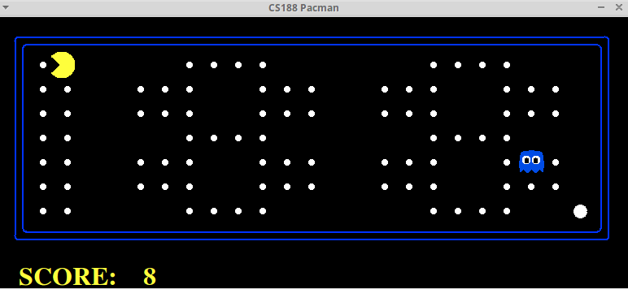
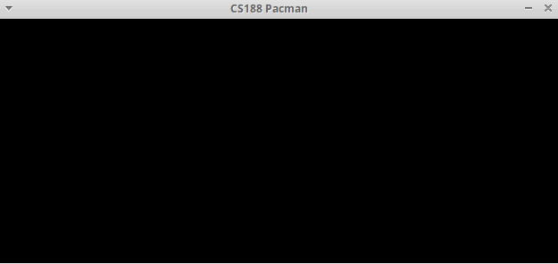

#Independent Coursework

Description
-----------------
There are a whole bunch of literally awesome CS courses offered by top tier universities such as UC Berkeley, MIT and Stanford, which are quite accessible online for free even to the public. All credits to the great host of intellectuals. So, I choose to work on some of them, watching or reading the lectures and doing homework and projects.

Index
-----------------
- [CS 61B Data Structures, Spring 2018, UC Berkeley](#cs-61b)
- [CS 188 Introduction to Artificial Intelligence, Fall 2018, UC Berkeley](#cs-188)

## [CS 61B](https://sp18.datastructur.es/)
 Data Structures, Spring 2018 by UC Berkeley

### Introduction
In CS61B, we’re concerned also with engineering. An engineer, it is said, is someone who can do for a dime what any fool can do for a dollar. Much of 61B will be concerned with the tradeoffs in time and memory for a variety of methods for structuring data. We’ll also be concerned with the engineering knowledge and skills needed to build and maintain moderately large programs.

 ### Acknowledgement
 Great thanks to *UC Berkeley*, an awesome and outstanding university, that keeps making a host of invaluable educational materials open to the public, even **autograders** for this year, which I appreciate so much. I really mean it, sincerely.

### My self-learning Coursework
  - finished:
    - [x] Week1~7
    - [x] hw1
    - [x] proj0~2
    - [x] lab1~5
  - TODO:
    - [ ] Week8~14
    - [ ] hw2~7
    - [ ] lab9~15
    - [ ] proj3

### Result
  For project 2, I chose to work on spring 2017 version, in which students are required to build a small version of what is called a relational database management system (DBMS), as well as a DSL (Domain Specific Language) with which a user can interact with the database.

  All other work was done by following the spring 2018 version of CS61B. **Source codes are lying in another repository, privately.**

  - Project
    1. Projcet0 - NBody
      - Running results:
        - planets:
        

        - sun interference:
        

        - glaxay:
        

      - tests from GradeScope:
        

    2. Project1 - Data Structures
      - tests from GradeScope:
        - project1A:
          
        - project1B:
          
        - project1gold:
          

    3. [Projcet2 - database](http://datastructur.es/sp17/materials/proj/proj2/proj2.html)
      - data files
        - [fans.tbl](CS61B/data/proj2/fans.tbl)
        - [records.tbl](CS61B/data/proj2/records.tbl)
        - [teams.tbl](CS61B/data/proj2/teams.tbl)
        - [t1.tbl](CS61B/data/proj2/t1.tbl)
        - [t2.tbl](CS61B/data/proj2/t2.tbl)
        - [t4.tbl](CS61B/data/proj2/t4.tbl)
      - running results:
        - query examples from the project2 spec webpage
        

        - more complicated queries with multiple conditions and some arithmetic operations:
        

  - Homework
    1. hw1
      - tests from GradeScope:
        

  - lab
    1. lab2
      - tests from GradeScope:
        

    2. lab3
      - tests from GradeScope:
        

## [CS 188](https://inst.eecs.berkeley.edu/~cs188/fa18/)
Introduction to Artificial Intelligence
Fall 2018, by Pieter Abbeel & Dan Klein, UC Berkeley

### Introduction

This course will introduce the basic ideas and techniques underlying the design of intelligent computer systems. A specific emphasis will be on the statistical and decision-theoretic modeling paradigm.

By the end of this course, you will have built autonomous agents that efficiently make decisions in fully informed, partially observable and adversarial settings. Your agents will draw inferences in uncertain environments and optimize actions for arbitrary reward structures. Your machine learning algorithms will classify handwritten digits and photographs. The techniques you learn in this course apply to a wide variety of artificial intelligence problems and will serve as the foundation for further study in any application area you choose to pursue.

### My self-learning Coursework
  - Exercises from edX
  - Project Pacman
  - Discussions

### Project
1. Project1 Search
  Keywords: **DFS, BFS, UFS, A\*, Heuristic Function**
  - DFS (Depth First Search)
  
  - BFS (Breadth First Search)
  
  - UFS (Uniform Cost Search)
  
  - A* Search
  
  - Heuristic
  

2. Project2 Games
Keywords: **Minimax, Alpha-Beta Pruning, Expectimax, Evaluation Function**
  - Reflex Agent
  
  - Minimax, Alpha-Beta Pruning, Expectimax (The two following anime are similar.)
  
